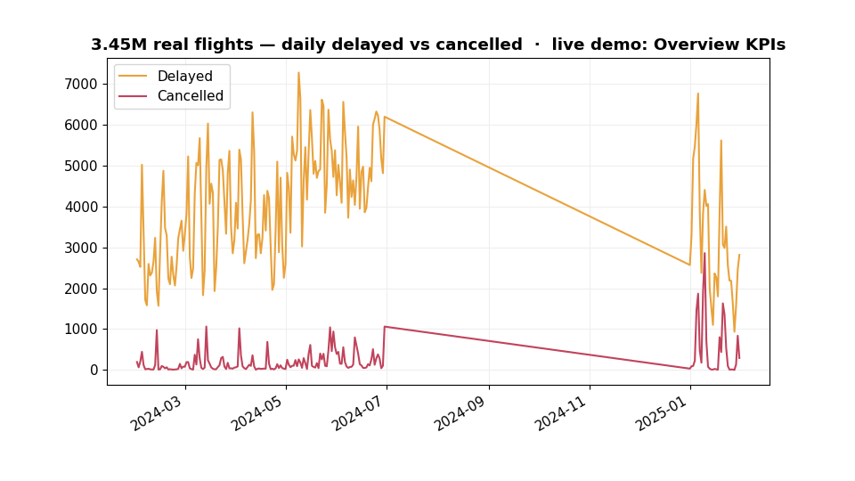
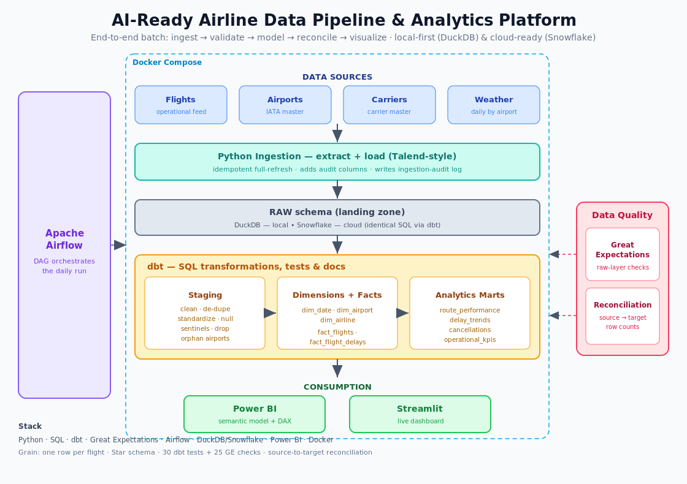

# Airline Data Platform

<p align="center">
  An end-to-end, production-shaped data engineering platform that ingests airline
  operational data, validates and models it into a tested star schema, and serves
  analytics — <strong>runs on a laptop, ships to the cloud unchanged.</strong>
</p>

<p align="center">
  <a href="https://github.com/your-username/airline-data-platform/actions/workflows/ci.yml">
    
  </a>
  <a href="https://your-username.github.io/airline-data-platform/lineage/">
    
  </a>
  
</p>

<p align="center">
  <a href="https://your-username.github.io/airline-data-platform/"><strong>Live Dashboard</strong></a> &nbsp;·&nbsp;
  <a href="https://your-username.github.io/airline-data-platform/lineage/"><strong>Data Catalog &amp; Lineage</strong></a> &nbsp;·&nbsp;
  <a href="docs/kpi_definitions.md"><strong>KPI Definitions</strong></a> &nbsp;·&nbsp;
  <a href="docs/data_profile.md"><strong>Real-Data Profile</strong></a>
</p>

<p align="center">
  
  
  
  
  
  
  
  
</p>

<p align="center">
  
</p>

---

## Overview

Airlines live and die by operational data — delays, cancellations, on-time performance. This platform ingests **3,453,795 real flights from the US DOT Bureau of Transportation Statistics** (Feb 2024 – Jan 2025, 345 airports, 15 carriers) and turns them into **governed, tested, analytics-ready** tables and dashboards using the same tools found in production data platforms: Python, SQL, dbt, Airflow, Great Expectations, a cloud-compatible warehouse, and Power BI — all wrapped in Docker.

The pipeline runs end-to-end on real data in approximately 70 seconds on a standard laptop: single-scan DuckDB ingestion (~25 s for 1.5 GB of monthly CSVs), Great Expectations validation, a 45/45-green dbt build, and row-level source-to-target reconciliation that identified and attributed 3 genuine duplicate records.

The design is **local-first, cloud-ready**: DuckDB by default; the identical dbt models target **Snowflake** by switching one profile entry. A synthetic data generator is available via `--source synthetic` for infrastructure-free demos.

---

## Measured Results

| Metric | Result |
|---|---|
| Real data ingested | **3,453,795 flights** — US DOT BTS, Feb 2024–Jan 2025, 345 airports, 15 carriers |
| Ingestion throughput | ~25 s for 1.5 GB of monthly CSVs (single-scan DuckDB materialization) |
| dbt build | **45/45 models and tests green in ~11 s** |
| Source-to-target reconciliation | Every row accounted for; **3 genuine duplicates** found and attributed |
| Data quality coverage | 18 Great Expectations checks + 30 dbt tests + freshness SLAs |
| ML model (Jan 2025 hold-out, 6-month gap) | Baseline AUC 0.6156 → **LightGBM 0.6223** — **1.6× lift** in the riskiest decile |
| CI | Full pipeline (real-format sample + synthetic) on every pull request — see badge |

---

## Architecture

<p align="center">
  
</p>

```
sources ─► ingestion (extract + load) ─► RAW ─► Great Expectations
                                               │
                           dbt:  staging ─► dims + facts ─► analytics marts
                                               │
                           reconciliation (source → target)   Power BI / Streamlit
         orchestrated by Airflow · packaged with Docker
```

Full design write-up with decisions and trade-offs: [docs/architecture.md](docs/architecture.md).

---

## Capabilities Demonstrated

- **ETL / ELT** — Extract and load into a warehouse `raw` layer with audit logging and idempotent, reproducible runs (Talend-style pattern).
- **Dimensional modelling** — A Kimball **star schema** (`fact_flights`, `fact_flight_delays` + conformed `dim_date` / `dim_airport` / `dim_airline`) built in **dbt** with surrogate keys and referential-integrity tests.
- **Data quality** — **Great Expectations** on the raw layer (nulls, duplicates, schema, value ranges), **30 dbt tests** on the modelled layers, and a **source-to-target row-count reconciliation** that proves no data is silently lost.
- **Orchestration** — An **Airflow** DAG running the daily batch, plus a no-Docker Python runner for local demos.
- **Analytics** — A **Power BI** semantic model (relationships + DAX measures) and a **Streamlit** dashboard over the same mart tables.
- **Engineering hygiene** — Config-driven, containerized, `make`-driven, and portable between DuckDB and Snowflake without model changes.

---

## Quickstart

```bash
# 1. Install dependencies
python -m venv .venv && source .venv/bin/activate
make setup

# 2. Run the full pipeline (generate → ingest → validate → dbt build → reconcile)
make pipeline

# 3. Explore results
make dashboard          # Streamlit at http://localhost:8501
```

For the production-like stack, `make docker-up` starts **Airflow** (http://localhost:8080) and the dashboard via Docker Compose.

To target **Snowflake** instead of DuckDB:

```bash
export WAREHOUSE=snowflake            # fill the SNOWFLAKE_* vars in .env
cd dbt/airline_dwh && dbt build --target snowflake
```

---

## Data Model

A classic star schema — one fact table at the grain of a single flight, surrounded by conformed dimensions:

| Table | Grain | Approx. rows |
|---|---|---|
| `fact_flights` | One row per flight | ~59.9 k |
| `fact_flight_delays` | One row per flight × delay cause | ~44 k |
| `dim_airport` / `dim_airline` / `dim_date` | Dimension | 40 / 10 / 91 |
| `route_performance` / `delay_trends` / `cancellations` / `operational_kpis` | Analytics marts | 1.4 k / 91 / 40 / 10 |

*Row counts from the default seeded run (60 k synthetic flights over Q1).*

---

## Data Quality — Three Layers

1. **Great Expectations** validates the raw feed and reports every defect (duplicate keys, `-9999` sentinel delays, orphan airport codes, missing tail numbers) to `quality/expectations/validation_report.json`.
2. **dbt tests** (`unique`, `not_null`, `relationships`, `accepted_values`, and custom singular tests) guard every modelled layer — the build fails if star-schema integrity is violated.
3. **Reconciliation** accounts for every source row across `source → raw → staging`, classifying each delta as a removed duplicate or a DQ-filtered record.

---

## Project Structure

```
airline-data-platform/
├── data/               # Synthetic source generator (+ real-data notes)
├── ingestion/          # Extract + load into the raw warehouse
├── quality/            # Great Expectations suites + source-to-target reconciliation
├── dbt/airline_dwh/    # Staging → dims/facts → analytics marts (+ tests)
├── airflow/dags/       # Daily orchestration DAG
├── orchestration/      # No-Docker local pipeline runner
├── dashboards/         # Streamlit app + Power BI semantic model (DAX, connection guide)
├── ml/                 # Delay-prediction model training, artifacts, and FastAPI serving
├── scripts/            # Mart export, chart rendering, and report utilities
├── docs/               # Architecture write-up, diagrams, and dashboard runbook
├── docker-compose.yml  # Airflow + Postgres + dashboard
└── Makefile            # One-command entrypoints
```

---

## Tech Stack

**Python · SQL · dbt · Apache Airflow · Great Expectations · DuckDB / Snowflake · Power BI · Docker · Pandas · LightGBM · FastAPI**

---

## Roadmap

- Incremental `fact_flights` on `flight_date` and dbt snapshots for SCD dimensions
- Live DOT/BTS On-Time Performance feed via S3 → Snowflake, replacing the static extract
- Extended dbt docs site with lineage, freshness SLAs, and Airflow alerting integration
- Expanded CI matrix: dbt build + Great Expectations on a real-format sample on every pull request
